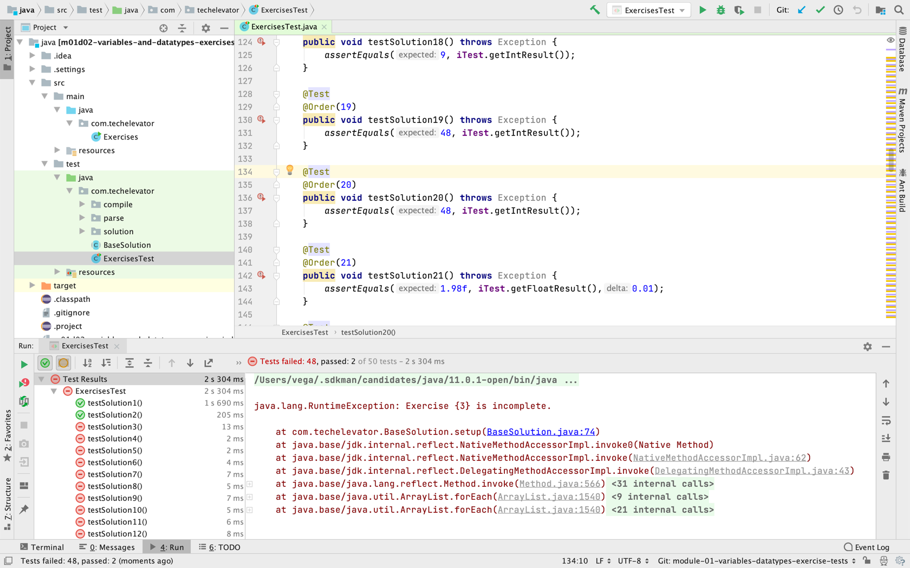

# Variables and data types

kor this exercise, you'll need to provide a response to each of the fifty-three problems defined in the code.

Your goal is to create the appropriate variables with the correct data types, assign values to the variables, and specify the correct operators needed to provide the expected answer.

## Learning objectives

After completing this exercise, you'll understand:

* Variable declaration, including
    * Good variable names
    * Appropriate data types
* Variable assignment
* How to use variables, literals, and operators within arithmetic expressions

## Evaluation criteria and functional requirements

Your work will be evaluated based on the following criteria:

* The project compiles without build errors.
* Variables are named appropriately, with good, meaningful names.
* Data types for variables are appropriate based on the value that's assigned to the variable.
* The expected result is correct for each task.

## Getting started

1. Import the variables and data types exercises project into IntelliJ.
2. Open the `Exercises.java` file that's in the project.
3. Make sure the project builds.
4. Begin working on the exercise by adding the necessary code below each question. See the example problem in the next section.

### Example

#### Problem

*There are four squirrels, and sixteen acorns. Assuming squirrels have a sense of fairness, how many acorns will each squirrel receive?*

#### Solution

```java
int acorns = 16;
int squirrels = 4;
int sharePerSquirrel = acorns / squirrels; //expected result
```

#### Tests

To verify your work, you can run the tests located in `src/test/java/com/techelevator/ExercisesTest.java`. To run the tests, right-click on the file and select `Run Exercises Test` from the context menu.



Be sure to verify that each exercise works by running the tests before moving on to the next one.

### Tips and tricks

#### Choose good variable names

One of the [hardest things about programming is choosing good names][naming-things-is-hard]. Focus on finding good, meaningful, and descriptive names for your variables.

Clarity and expressiveness are more important than brevity. Err on the side of longer, more descriptive names over short, cryptic ones.

Try this: when you're naming your variables, read them out loud. Do they read like a sentence? If you read them to another person, can they understand what you're saying? If not, keep working on the names of your variables.

*Remember that variables must be camelCase in Java.*

#### Be consistent with your choice of data types

It's important to be consistent with the data types you use, especially when it comes to some values like money. There are many different ways to express money. For the purposes of this exercise, you can use the type `double`.

> **Note**: In a real-world, production application, you'd never use a `float` or `double` data type for monetary values. There's a more precise data type for money, which you'll learn about later in the cohort. For now, use the type `double` for this exercise.

#### Write clean code

*Keep your code consistent and well formatted.* When code is poorly indented, or lost in a flood of blank lines, it can be difficult to read.

#### Don't linger too long on one problem

If you find yourself stuck on a problem more than fifteen minutes, move on to the next, and try again later. You may figure out the solution after working through another problem or two.

#### Don't forget to commit

As you're working through problems, it's a good idea to *commit early and often*. This means that once you've written enough code to complete a task, add your changes and commit them.

Work on getting into the habit of writing [good commit messages][good-commit-messages].

---

[good-commit-messages]: https://chris.beams.io/posts/git-commit/
[naming-things-is-hard]: https://hilton.org.uk/blog/why-naming-things-is-hard
